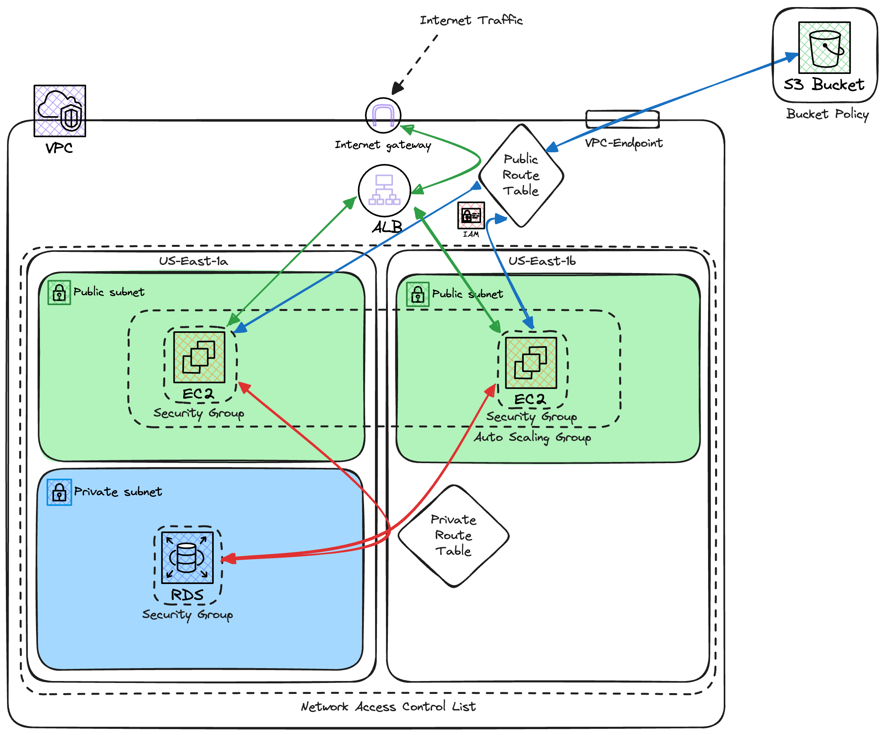

# Twoge Deployment Assessment

> Code Platoon Bravo DevOps Cohort Assessment One

## Purpose

This assessment covers the first modules of the Code Platoon DevOps curriculum. This comprises of Amazon Web Services resources and services, including:

- EC2 (Elastic Compute Cloud): To host the Twoge application.

- S3 (Simple Storage Service): To store static files, such as images, videos, and other assets.

- IAM (Identity and Access Management): To manage services' access and permissions to AWS resources.

- VPC (Virtual Private Cloud): To create a secure and isolated network environment for the application.

- ALB (Application Load Balancer): To distribute incoming traffic across multiple EC2 instances.

- ASG (Auto Scaling Group): To automatically scale EC2 instances up or down based on the demand.

- SNS (Simple Notification Service): To receive notifications about your application's performance and health.

- RDS (Relational Database Service): To host the database for the application.

The goal of this assessment is to deploy the Twoge application to AWS using AWS' many services and their respective advantages. The [source code is located here](https://github.com/chandradeoarya/twoge).

Clone the code into your local machine for certain portions of this assessment with the following command:

```shell
git clone https://github.com/chandradeoarya/twoge
```

## Architecture



This architecture diagram illustrates the entirety of all AWS resources and services that are used to host the Twoge application. 

- Outside of the VPC is an S3 bucket that houses all of the application's static assets, such as images and videos. 
    - This S3 bucket blocks all public access, but the individual EC2 instances hosting the Twoge application can access it. This is possible due to a bucket policy allowing a specific IAM role to have full access to it, and each EC2 instance assuming that IAM role when it is launched.

- The VPC houses all of the other AWS resources. 
    - Directly attached to this VPC is an internet gateway and a VPC endpoint. The internet gateway allows internet traffic in and out of the VPC, and the VPC endpoint is created specifically to access the S3 bucket for the Twoge application.
    - The VPC hosts two public subnets a private subnet, and an Application Load Balancer (ALB). Traffic is routed to these subnets and ALB using a route table, noted on the diagram as "Public Route Table".

- An Application Load Balancer (ALB) sits inside of the VPC and forwards all internet traffic to EC2 instances.
    - It chooses which compute instance to forward traffic to depending on a number of factors, including the amount of incoming traffic, instance utilization, and more.

- A Network Access Control List (NACL) sits outside of the subnets and ensures that only traffic in compliance with its ruleset is allowed in and out of each subnet.

- In each availability zone, a public subnet hosts a number of EC2 instances.
    - These EC2 instances are managed by an Auto Scaling Group. This Auto Scaling Group ensures that EC2 instances are shut down when CPU utilization falls under a 70% threshold (scaled in), and launched when CPU utilization of instances go beyond 70% (scaled out).

- Each EC2 instance is wrapped by two Security Groups. 
    - The main security group allows inbound SSH traffic from my IP address and inbound HTTP requests on port 80. All outbound traffic is permitted.
    - The other security group explicitly allows only traffic on port 5432 in and out to the RDS Postgres database in the private subnet. This is the most secure way to ensure that the RDS instance is not compromised.

- The private subnet houses an RDS instance with the PostgreSQL engine.
    - This RDS instance has one Security Group allowing only inbound and outbound traffic on port 5432 to EC2 instances in the public subnets.
    - Traffic between the RDS instance and EC2 instances is routed through another route table with no link to the internet gateway, depicted in the diagram as "Private Route Table".

## Steps for Accomplishment

[**1. Create the VPC**](./docs/vpc-creation.md): Creates the VPC required to house and connect all required AWS services and resources.

[**2. Create the S3 Bucket**](./docs/s3-bucket-creation.md): Creates the S3 bucket to hold all static assets.

[**3. Create the IAM Role for S3**](./docs/iam-role-creation.md): Creates the IAM role for the Twoge application EC2 to assume for access to S3 buckets.

[**4. Configure S3 Bucket Policy**](./docs/s3-bucket-policy.md): Updates the S3 bucket's policy to allow the new IAM role to access it.

[**5. Launch the EC2 Instance**](./docs/ec2-creation.md): Launch the initial EC2 instance with necessary hardware, software, network, and security configurations.

[**6. Launch the RDS Database**](./docs/rds-postgres-creation.md): Create the RDS instance hosting PostgreSQL for the Twoge application to utilize.

[**7. Set Up the Twoge Application**](./docs/twoge-setup.md): Configure and launch the Twoge daemon and Nginx configuration for hosting the application.

**8. Test the RDS and EC2 Connection**

- To ensure that the RDS and EC2 are communicating correctly, navigate to the "Twoges" tab of the application and create a new post.

- If the post registers successfully and displays on the page, then the RDS connection is established and working correctly.

[**9. Create a Target Group**](./docs/target-group-creation.md): Create the Target Group for the Application Load Balancer.

[**10. Create the Application Load Balancer**](./docs/alb-creation.md): Create the ALB for the Auto Scaling Group.

[**11. Create the Launch Template of the EC2 instance**](./docs/img-template-creation.md): Create the Launch Template for the ASG to use.

[**12. Create the ASG**](./docs/asg-creation.md): Create the Auto Scaling Group to both scale in and scale out the Twoge application.

[**13. Test SNS**](./docs/testing-sns.md): Ensure that SNS scaling notifications work correctly.

## Attribution

The Code Platoon DevOps Instructors have done a phenomenal job teaching us the basics and fundamentals of AWS services and resources, allowing us to successfully complete this assessment using networking, security, reliability, and scalability best practices.

The Twoge application was created for the Code Platoon DevOps curriculum, by the Instructors, and is purely educational. This application and program is strictly prohibited for use in a commercial or solicitation setting.

<div align="center">&copy; Code Platoon 2024</div>
