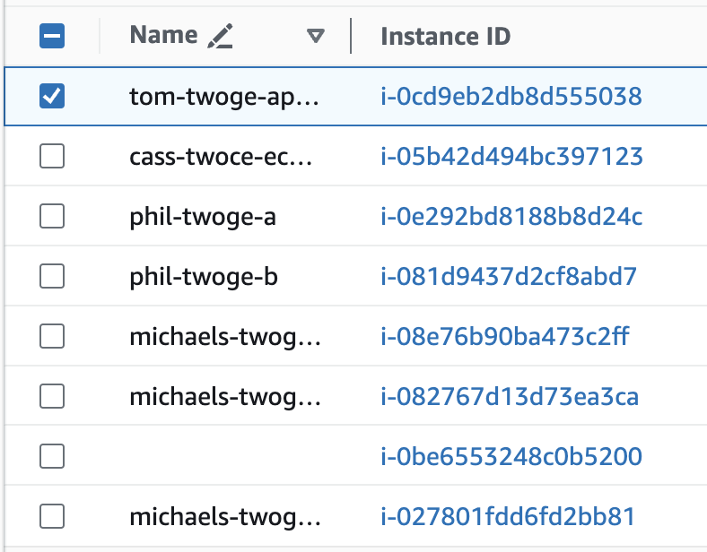
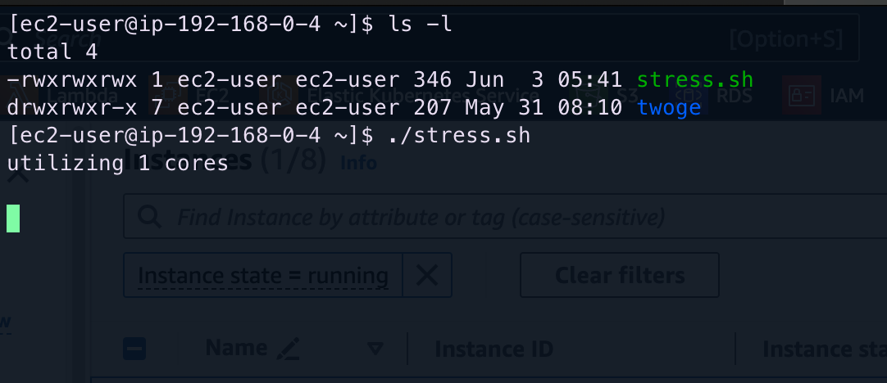
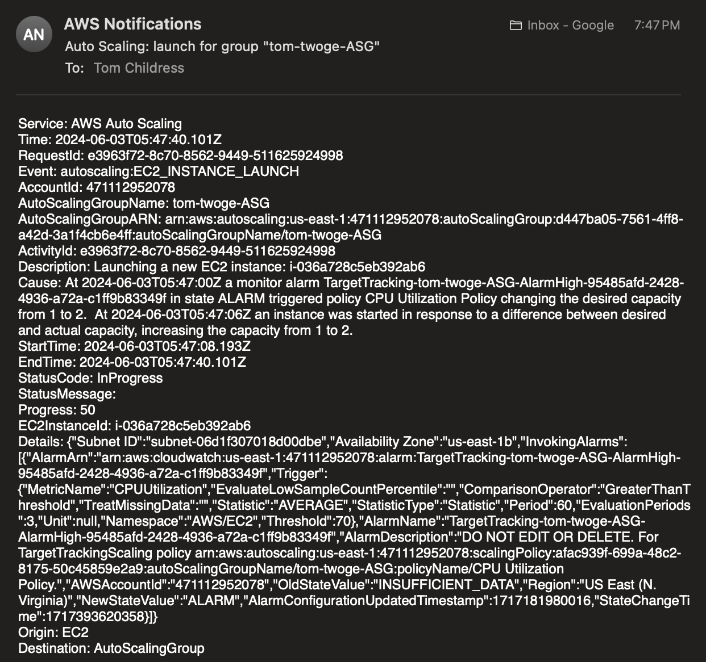
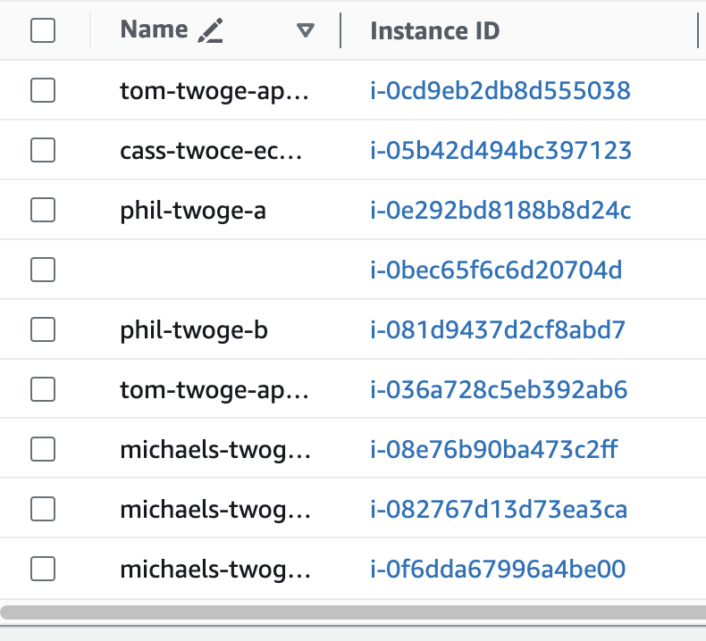

## Running a Stress Test

Manually starting and shutting down EC2 instances to test Auto Scaling is one thing, but testing them in-line with the ASG's purpose is much better. The Auto Scaling Group is meant to handle launching and stopping automatically due to different CloudWatch metrics. The one chosen for the Twoge application deployment was CPU utilization, and we are going to test that here.

1. Navigate to the EC2 Dashboard in the AWS Management Console, and select one of your ASG's instances.

2. SSH into the instance by copying the public IP address and running the following command:

```shell
ssh -i <path/to/your-key.pem> ec2-user@<ec2-public-IP>

# You will be asked about the authenticity of the IP address of an unknown host again. Type "yes" and continue.
```

3. Now, once inside of your EC2 instance, type the following command to enter a text editor for the stress test file:

```shell
sudo vim stress.sh
```

4. Inside of the file, type:

```python
#!/usr/bin/env python
"""
Produces load on all available CPU cores
"""

from multiprocessing import Pool
from multiprocessing import cpu_count

def f(x):
    while True:
        x*x

if __name__ == '__main__':
    processes = cpu_count()
    print ('utilizing %d cores\n' % processes)
    pool = Pool(processes)
    pool.map(f, range(processes))
```

5. Save and quit the file, then run the following command to make the script executable:

```shell
chmod 700 stress.sh
```

> [!NOTE]
> Take note of the amount of instances your ASG is running before running this stress test. In the below image, my ASG is running one instance, because the CPU utilization of that instance is not over 70%.



6. Finally, execute the stress test with the following command:

```shell
./stress.sh
```

> [!TIP]
> The script produces meaningful output depending on the type of EC2 instance you are running. In this case, since we are running Twoge on a t2.micro, the instance only has one CPU core. The script produces this output that it is utilizing that one core.



7. Now, watch your email and wait for the SNS notification that an EC2 instance is being launched due to the fact that the other instance's CPU utilization is too high. Additionally, refresh your instances page in the dashboard and watch the other instance be started.



<br />



<br />

If the launch is successful, the test is complete! Your Auto Scaling Group is performing its intended purpose, and your Twoge application is ready for heavy internet traffic.