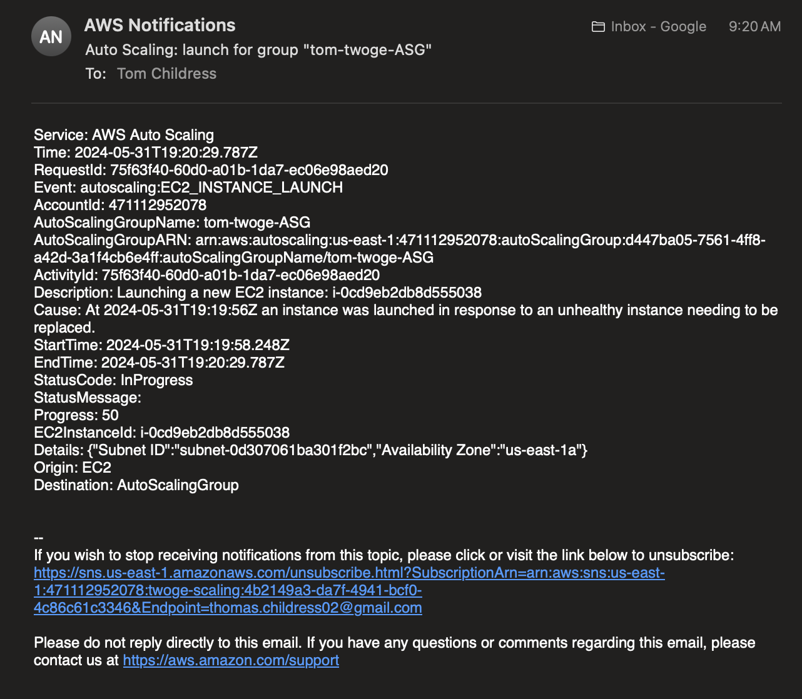
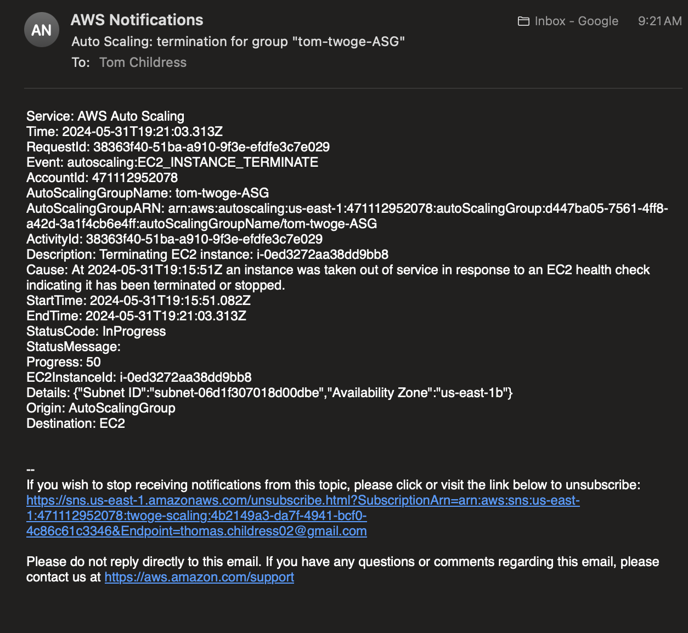

## Testing SNS

SNS will automatically send emails to the correct email address when a server is shut down.

> [!CAUTION]
> Before testing this, ensure that you visit the email address entered in the SNS topic recipient and accept the subscription. If the subscription is not accepted, you will not receive emails pertaining to the scaling policy.

1. In the EC2 Dashboard of the AWS Management Console, select one of the Twoge application instances. Go to the "Instance state" dropdown above and select "Stop instance".
2. Check the email entered for the SNS topic and ensure that an email was received

    
Launch Example:

    
    
Termination Example

    

